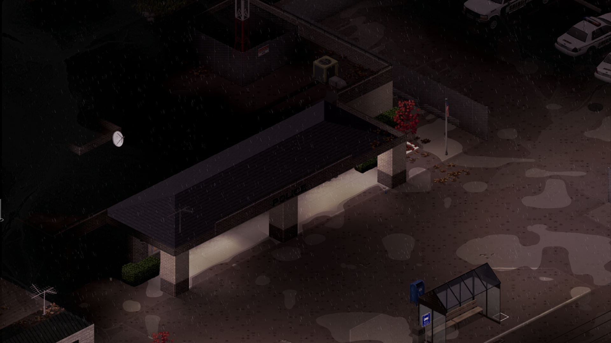
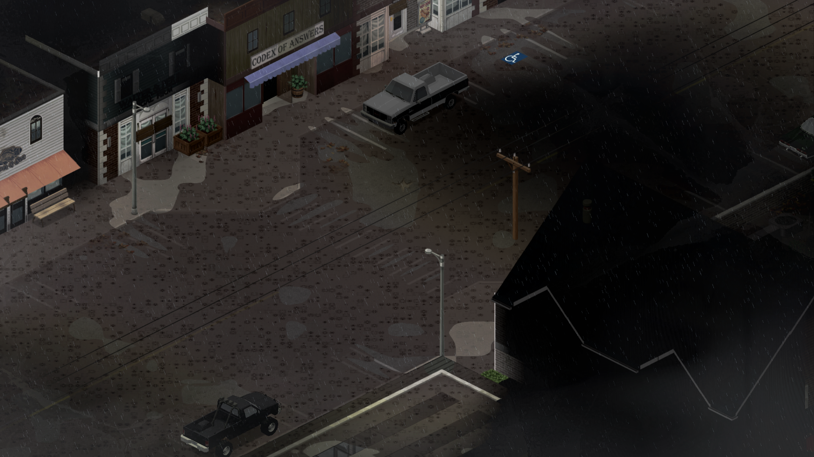
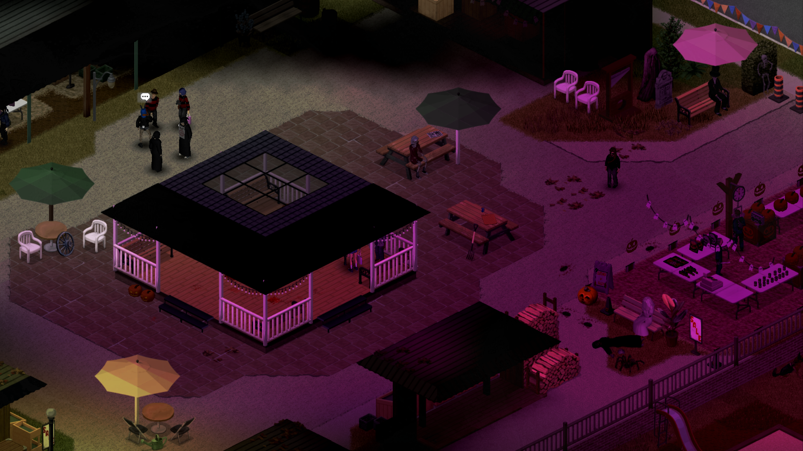
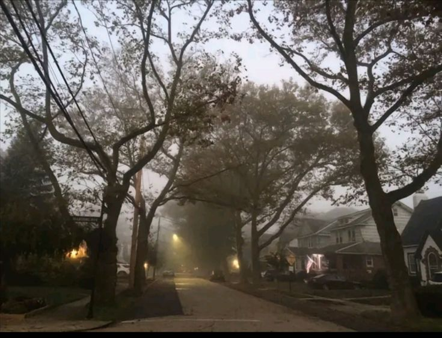
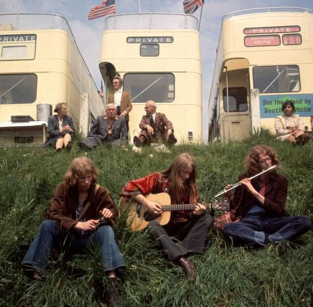

<html>
<head>
  <meta charset="UTF-8">
  <title>Buffalo County Times</title>
  
</head>
<body>
  <table class="layout">
    <!-- Заголовок -->
    <tr>
      <td colspan="2" class="header">Buffalo County Times — Local News</td>
    </tr>

    <!-- Бегущая строка + баннер -->
    <tr>
      <td colspan="2">
        

          <marquee>Добро пожаловать на Buffalo County Times. Сегодня 11 октября 2001 года.</marquee>
        

        
      </td>
    </tr>

    <!-- Основная часть -->
    <tr>
      <!-- Меню -->
      <td class="menu">
        <b>Разделы</b> 
        <a href="#">Главная</a> 
        <a href="#">Политика</a> 
        <a href="#">Экономика</a> 
        <a href="#">Общество</a> 
        <a href="#">Культура</a> 
        <a href="#">Спорт</a> 
        <a href="#">Технологии</a> 

        <!-- Блок рекламы -->
        

        <!-- Погода -->
      

    <h4>Погода в Buffalo Hill</h4>
    
<b>Температура:</b> +12°C

    
<b>Облачность:</b> Пасмурно

    
<b>Осадки:</b> 0 мм

    

    
    
      </td>
      <!-- Новости -->
      <td class="content">
        <!-- Шаблон новости (1 из 7) -->
        

          
Дело закрыто!

          
11 октября 2001

          

            Полицейское расследование в отношении бывшего окружного прокурора Буффало, Чарльза Харрингтона подошло к концу и ему окончательно предъявлены обвинения в коррупции и злоупотреблении полномочиями. В ближайшее время Харрингтона перевезут в соседний округ где начнутся судебные слушания. Наше агентство обратилось за комментарием к заместителю шерифа, однако он отметил что пока не может давать никаких пояснений по данному делу. Для жителей города это событие стало окончательной точкой в истории старого прокурора.
          

          
        

        <!-- Повтори ещё 6 таких блоков -->
        

          
Дожди

          
11 октября 2001

          

            В Буффало Хилл синоптики отмечают возвращение обильных дождей которых город не видел на протяжении долгого времени. 10 октября жители стали свидетелями сразу двух сильных ливней: первый прошел утром и слегка затопил несколько улиц в центральной части, а ближе к ночи весь город оказался под плотной стеной дождя. По прогнозам метеорологов осадки сохранятся и в ближайшие дни что может повлечь перебои в движении транспорта и локальные подтопления в низинах.
          

          
        

        

          
Ярморка!

          
13 октября 2001

          

            Сегодня в Буффало Хилл прошла очередная ярморка на этот раз посвещенная хэллуинском празднику который вот-вот наступит. Проходила она в центре города и каждый желающий мог без каикх-либо проблем ее посетить, там же граждане могли купить себе костюмы и сувениры посвещенные жуткой тематике. К слову во время мероприятия произошло действительно кое-что жуткое, очевидцы рассказывают про драку двух людей в костюмах Джейсона Вурхиза, наша редакция надеятся на то что она состоялась на кулаках, а не на мачете. Так или иначе многие довольно лестно высказываются о прошедшем мероприятии, многие закупили красивы костюмы и сувениры которые теперь пробудут с ними до следующей такой-же мимолетной ярморки. Кроме этого нашей редакции удалось взять небольшое не многословное интервью по поводу проведения мероприятия, молодые люди кроме того так-же заявили о том что у них есть собственная музыкальная группа, а заняться ярморкой они решили из собственного желания, вот что нам удалось узнать на интерьвью: 
             
- Вам понравилась ярморка?

             
- Конечно-же, это одна из многочисленных ярморок в Буффало Хиллс и для нас большая честь что именно мы смогли провести ее!

             
- Сложно ли было организовать ярморку?

             
- Знаете на самом деле достаточно тяжело, мы получили минимальное финансирование от мэрии из-за чего многое пришлось брать из своего кармана!

             
- А можете ли вы дать какой-нибудь коментарий по поводу произошедшей драки?

             
- Конечно, лично мой знакомый в ней участвовал и к сожалению он проиграл! К слову хотите послушать про нашу группу...

    Думаю на этом можно заканчивать статью, конечно-же нашу редакцию напрягает тот факт что на ярморке вот так просто может произойти какая-то драка, кто знает что могло бы случиться если-бы у кого-то из участников оказлся бы нож. Поэтому наша редакция настоятельно вас просит быть осторожными на подобных мероприятиях, ведь кто знает что может произойти!
          

          
        

        

          
Проблемы с транспортом

          
8 октября 2001

          

            Автобусное сообщение между Буффало Хиллс и Сиэттлом временно ограничено из-за нехватки водителей. Власти обещают восстановить расписание в течение недели.
          

          
        

        

          
Заморозки

          
7 октября 2001

          

            На прошлой неделе зафиксирован первый заморозок: фермеры округа предупреждают о возможной потере части урожая.
          

          
        

        

          
Отмененный фестиваль

          
6 октября 2001

          

           Городской фестиваль был отменен, из-за этических соображений и сочуствий в связи с трагедией 11-го числа, а так-же из-за соображения безопастности.
          

          
        

        

          
Скандальный арест окружного прокурора

          
6 октября 2001

          

            На днях федеральные агенты ФБР произвели арест окружного прокурора округа Буффало Чарльза Харрингтона. Ему предъявлены обвинения в получении взяток в особо крупных размерах.

           По сведениям источников, на протяжении последних лет своей деятельности Харрингтон систематически занимался фальсификацией и уничтожением вещественных доказательств за денежные вознаграждения, что позволило избежать наказания ряду опасных преступников.

          Временно исполняющим обязанности назначен его единственный помощник. Новые выборы окружного прокурора округа Буффало состоятся в ближайшие месяцы.
          

          
        

      </td>
    </tr>

    <!-- Подвал -->
    <tr>
      <td colspan="2" class="footer">
        © Buffalo County Times, 2001 
        
Вы посетитель № 6026

      </td>
    </tr>
  </table>
</body>
</html>
