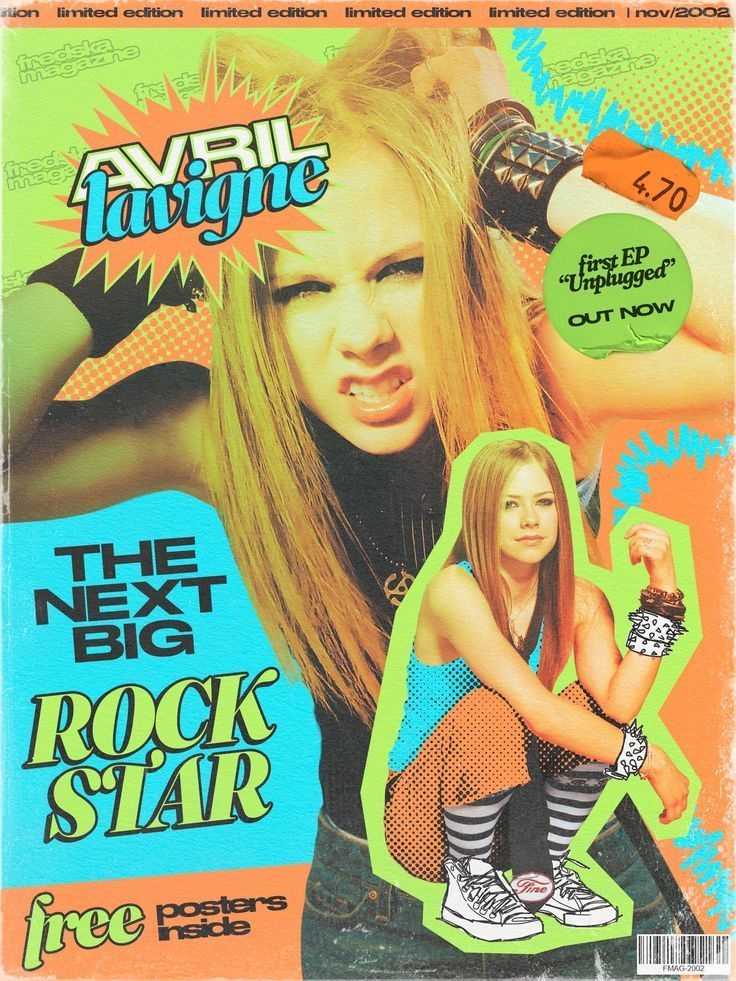
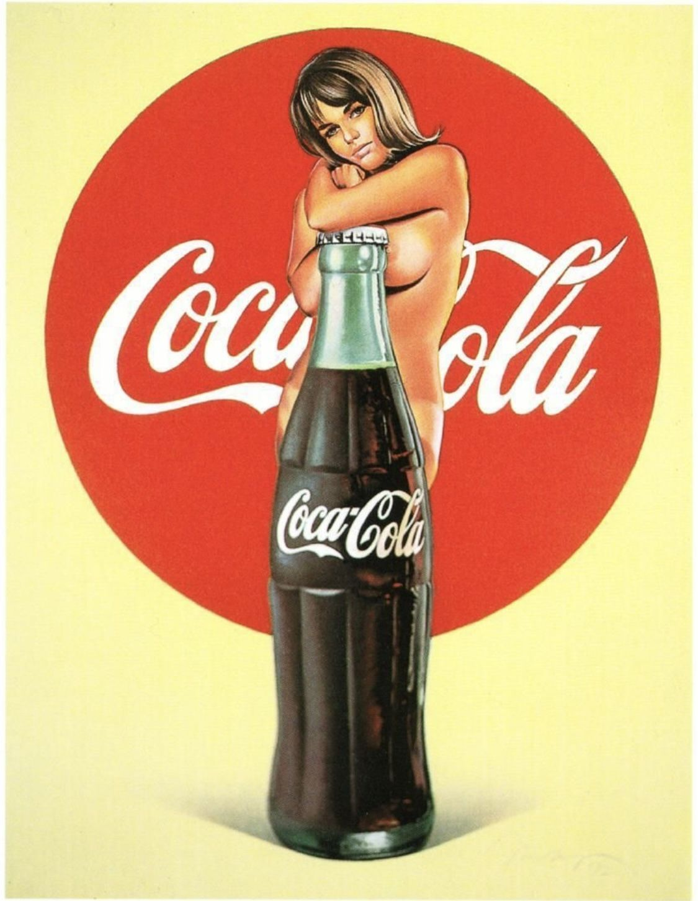

<html>
<head>
  <meta charset="UTF-8">
  <title>Buffalo County Times</title>
  
</head>
<body>
  <table class="layout">
    <!-- Заголовок -->
    <tr>
      <td colspan="2" class="header">Buffalo County Times — Local News</td>
    </tr>

    <!-- Бегущая строка + баннер -->
    <tr>
      <td colspan="2">
        

          <marquee>Добро пожаловать на Buffalo County Times. Сегодня 10 октября 2001 года.</marquee>
        

        
      </td>
    </tr>

    <!-- Основная часть -->
    <tr>
      <!-- Меню -->
      <td class="menu">
        <b>Разделы</b> 
        <a href="#">Главная</a> 
        <a href="#">Политика</a> 
        <a href="#">Экономика</a> 
        <a href="#">Общество</a> 
        <a href="#">Культура</a> 
        <a href="#">Спорт</a> 
        <a href="#">Технологии</a> 

        <!-- Блок рекламы -->
        

        <!-- Погода -->
      

    <h4>Погода в Buffalo Hill</h4>
    
<b>Температура:</b> +18°C

    
<b>Облачность:</b> Переменная

    
<b>Осадки:</b> 2 мм

    

    
    
      </td>
      <!-- Новости -->
      <td class="content">
        <!-- Шаблон новости (1 из 7) -->
        

          
Мэр выступил с заявлением

          
10 октября 2001

          

            Сегодня мэр Buffalo Hill обратился к жителям округа Буффало, подчеркнув необходимость единства общества и поддержки друг друга после недавних трагических событий в стране.
          

          
        

        <!-- Повтори ещё 6 таких блоков -->
        

          
Новый медицинский центр

          
9 октября 2001

          

            В пригороде Буффало Хилл открылся новый медицинский центр. Это значительно упростит доступ к лечению для жителей округа и создаст новые рабочие места.
          

          
        

        

          
Фермерский рынок вновь открылся

          
9 октября 2001

          

            Жители округа с радостью встретили возвращение фермерского рынка. Свежие овощи, фрукты и домашняя выпечка снова доступны каждую субботу на главной площади города.
          

          
        

        

          
Проблемы с транспортом

          
8 октября 2001

          

            Автобусное сообщение между Buffalo Hill и Сиэттлом временно ограничено из-за нехватки водителей. Власти обещают восстановить расписание в течение двух недель.
          

          
        

        

          
Школьная команда победила соседний округ

          
7 октября 2001

          

            Футбольная команда старшей школы Buffalo Hill одержала победу над командой округа Риверсайд. Игра собрала сотни болельщиков.
          

          
        

        

          
Культурный фестиваль в Buffalo Hill

          
6 октября 2001

          

            В городском парке прошёл ежегодный культурный фестиваль. Музыка, танцы и кулинарные угощения из разных культур собрали жителей всех возрастов.
          

          
        

        

          
Новые рабочие места

          
5 октября 2001

          

            В промышленной зоне Buffalo Hill открылся новый завод, который обеспечит более сотни жителей округа стабильной работой.
          

          
        

      </td>
    </tr>

    <!-- Подвал -->
    <tr>
      <td colspan="2" class="footer">
        © Buffalo County Times, 2001 
        
Вы посетитель № 6026

      </td>
    </tr>
  </table>
</body>
</html>
